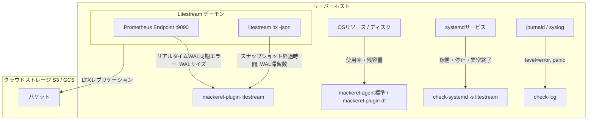

# Litestream 監視設計・運用ガイド

本ドキュメントでは、SQLite のリアルタイムレプリケーションツールである **Litestream** を Mackerel で安全かつ低コストに監視するための全体設計、既存 Mackerel プラグインとの役割分担、および推奨設定・アラートルールについて解説します。

---

## 1. 監視アーキテクチャとプラグインの役割分担

Litestream は SQLite の WAL (Write-Ahead Log) をリアルタイムにクラウドストレージ（S3, GCS, Azure Blob 等）へ冗長化する極めて重要なミッションクリティカルコンポーネントです。
Mackerel のエコシステムでは、**「メトリックプラグイン（時系列数値）」** と **「チェックプラグイン（死活・状態判定）」** を組み合わせることで、**メトリクス課金を最小限に抑えつつ高精度な障害検知**を実現できます。

### プラグイン役割分担マトリクス



| 監視領域 / 障害モード | 推奨担当プラグイン | 種別 | メトリック消費 | 役割分担の理由・推奨設定 |
| :--- | :--- | :---: | :---: | :--- |
| **プロセス死活監視** | `check-systemd` | チェック | **0** | **プロセスの生死はチェックプラグインで判定するのがMackerelのベストプラクティス**。サービス停止時に即時アラート。 |
| **ログエラー検知** | `check-log` | チェック | **0** | syslog や journald (`journalctl -u litestream`) 内の `level=error` やパニックを検知。 |
| **ホストOSディスク容量** | `mackerel-agent` 標準 / `mackerel-plugin-df` | メトリック | 標準内 | ディスク残容量20%未満、10GB未満で警告。ステージング枯渇を未然に防止。 |
| **WAL同期エラー・停止** | `mackerel-plugin-litestream` | メトリック | 1 | プロセスが生きていてもWAL同期が詰まる「サイレント障害」を検知。 |
| **データ整合性検証エラー** | `mackerel-plugin-litestream` | メトリック | 1 | LTXコンパクション後のハッシュ・破損エラーを検知（最重要）。 |
| **SQLite WALファイル肥大化** | `mackerel-plugin-litestream` | メトリック | 1 | SQLiteの長時間ロックやチェックポイント詰まりによるWAL肥大化を検知。 |
| **スナップショット経過時間** | `mackerel-plugin-litestream` | メトリック | 1 | 最新フルスナップショットが何時間前に作成されたかをリアルタイム監視。 |
| **未コンパクションWAL数** | `mackerel-plugin-litestream` | メトリック | 1 | 最新スナップショット以降に溜まったWAL数。リストア所要時間悪化の予兆検知。 |
| **リモート総量 / サイズ** | `mackerel-plugin-litestream` | メトリック | 2 | CloudWatchのS3メトリクス（24時間遅延）を待たずに、現在の総オブジェクト数と容量を把握。 |

> [!TIP]
> **チェックプラグイン（`check-systemd`, `check-log`）の活用メリット:**
> Mackerel ではチェック監視（`[plugin.checks.*]`）はホストメトリック課金枠を一切消費しません。
> プロセスの死活監視をチェックプラグインに任せることで、メトリック数を節約しながら安全な監視が可能です。

---

## 2. メトリクス課金コストの抑制（チューニング方針）

Mackerel では 1ホストあたり通常 30〜50 メトリックが基本料金に含まれており、超過すると従量課金が発生します。
本プラグインでは、メトリクスグループごとにフラグで ON/OFF を切り替えられます。

### 推奨モード比較

| 運用モード | 指定フラグ | 1DBあたりのメトリック数 | 推奨用途 |
| :--- | :--- | :---: | :--- |
| **① エコノミーモード (最安)** | `-enable-snapshot=false` (Core + Storage のみ) | **5 メトリック** | 多数のDBを抱えるサーバーや、スナップショット監視を別間隔に分離したい場合 |
| **② 標準モード (推奨・デフォルト)** | （追加フラグなし） | **8〜9 メトリック** | **通常の商用環境**。重要エラー、WAL容量、スナップショット鮮度を網羅 |
| **③ フル観測モード** | `-enable-sync-stats -enable-checkpoint -enable-retention -enable-replica-ops` | **20〜30 メトリック** | パフォーマンスチューニング時や、S3転送量・レイテンシを詳細に可視化したい場合 |

---

## 3. Mackerel エージェント設定例 (`/etc/mackerel-agent/mackerel-agent.conf`)

以下は、`check-systemd`, `check-log` と本プラグインを組み合わせた商用環境推奨の設定例です。

```ini
# ==============================================================================
# Mackerel Agent Configuration for Litestream Monitoring
# ==============================================================================

# 1. systemd によるプロセス死活監視 (メトリック枠消費: 0)
[plugin.checks.litestream_systemd]
command = ["check-systemd", "-s", "litestream.service"]

# 2. ログ内のエラー検知 (メトリック枠消費: 0)
[plugin.checks.litestream_log]
command = ["check-log", "--file", "/var/log/litestream.log", "--pattern", "level=error|panic:"]

# 3. リストア検証チェック監視 (メトリック枠消費: 0、30分毎実行)
[plugin.checks.litestream_restore]
command = [
    "/usr/local/bin/mackerel-plugin-litestream",
    "-check-restore",
    "-config", "/etc/litestream.yml",
    "-restore-check-interval", "30m"
]
check_interval = 30

# 4. Litestream 内部メトリクス監視 (標準モード: 約11メトリック)
[plugin.metrics.litestream]
command = [
    "/usr/local/bin/mackerel-plugin-litestream",
    "-url", "http://localhost:9090/metrics",
    "-config", "/etc/litestream.yml",
    "-systemd-service", "litestream.service",
    "-snapshot-cache-ttl", "5m"
]
```

---

## 4. 推奨アラートルール集

Mackerel の監視ルール設定画面（Webコンソール）で登録すべき推奨アラートの定義です。

### 🚨 Critical アラート（即時オンコール・Pager通知）

| アラート名 | 監視対象メトリック | 閾値条件 | 対応手順 |
| :--- | :--- | :--- | :--- |
| **Litestream プロセスダウン** | チェック監視 `litestream_systemd` | CRITICAL | サービスが停止またはクラッシュしています。`journalctl -u litestream -n 100` で原因を確認し、サービスを再起動してください。 |
| **レプリカ復元失敗 (Restore Error)** | チェック監視 `litestream_restore` または `custom.litestream.restore.*.restore_error` | CRITICAL または 平均 > 0 | **リモートレプリカからの復元（リストア）ができません**。LTXヘッダ不整合、S3認証エラー、またはデータ破損の恐れがあります。直ちに `litestream restore -dry-run` を手動実行して詳細を確認してください。 |
| **スナップショット消失・不在** | `custom.litestream.snapshot_wal.*.snapshot_missing` | 平均 > 0 | **リモートストレージからフルスナップショットが消失したか、1件も存在しません**。直ちにフルスナップショットを再生成してください。 |
| **WAL同期エラー発生** | `custom.litestream.core_errors.*.sync_error_count` | 連続 1 回 > 0 (Diff) | WALの読み取りや転送に失敗しています。ローカルディスク容量やファイルパーミッション、SQLiteロック競合を確認してください。 |
| **コンパクション検証エラー** | `custom.litestream.core_errors.*.verify_error_count` | 連続 1 回 > 0 (Diff) | **バックアップデータ破損の疑いがあります**。早急に `litestream verify` を実行し、直近のバックアップ整合性を調査してください。 |
| **ディスクフルによる停止** | `custom.litestream.core_errors.*.disk_full` | 平均 > 0 | ローカルディスクが枯渇し、LTXステージングが停止しています。不要ファイルを削除して空き容量を確保してください。 |

### ⚠️ Warning アラート（営業時間内対応・予兆検知）

| アラート名 | 監視対象メトリック | 閾値条件 | 兆候と対策 |
| :--- | :--- | :--- | :--- |
| **スナップショット作成遅延** | `custom.litestream.snapshot_age.*.latest_age_seconds` | 平均 > 108000 (30時間) | 24時間間隔のバックアップ設計の場合、30時間を超えても新しいスナップショットが作られていません。設定やログを確認してください。 |
| **未コンパクションWAL滞留** | `custom.litestream.snapshot_wal.*.wal_files_since_snapshot` | 平均 > 1000 | 最新スナップショット以降に未コンパクションWALが1000個以上滞留しています。リストア所要時間が悪化するため、フルスナップショットまたはコンパクションを実施してください。 |
| **SQLite WALファイル肥大化** | `custom.litestream.storage.*.wal_bytes` | 平均 > 104857600 (100MB) | WALが100MBを超えています。長時間トランザクションによるチェックポイント詰まりの可能性があります。 |
| **リストア検証遅延** | `custom.litestream.restore.*.restore_duration_seconds` | 平均 > 30.0 (秒) | リストア計画の検証に30秒以上かかっています。ネットワーク帯域やリモートストレージの応答速度を確認してください。 |

---

## 5. トラブルシューティング

### Q1. メトリクスが取得できず `alive: 0` になる
- **原因 1**: Litestream の設定ファイル (`/etc/litestream.yml`) に `addr: ":9090"` が記載されていない。
  - **対策**: 設定ファイルに `addr: ":9090"` を追記し、Litestream サービスを再起動してください。
- **原因 2**: ファイアウォールやバインドアドレスの問題。
  - **対策**: `curl -s http://localhost:9090/metrics` がホスト内で応答を返すか確認してください。

### Q2. systemd サービス停止時にアラートを飛ばしたくない（メンテナンス時）
- `systemctl stop litestream` だけでなく、`systemctl disable litestream` を行うと、本プラグインはメトリクス出力を自動的にスキップし、不要なアラート発火を防ぎます。

### Q3. リストアチェックをメトリック課金枠を消費せずに行いたい
- Mackerel のチェック監視機能（`[plugin.checks.litestream_restore]`）にて `-check-restore` フラグを指定してください。メトリック数を消費せず、リストア失敗時のみ CRITICAL 通知を受信できます。

